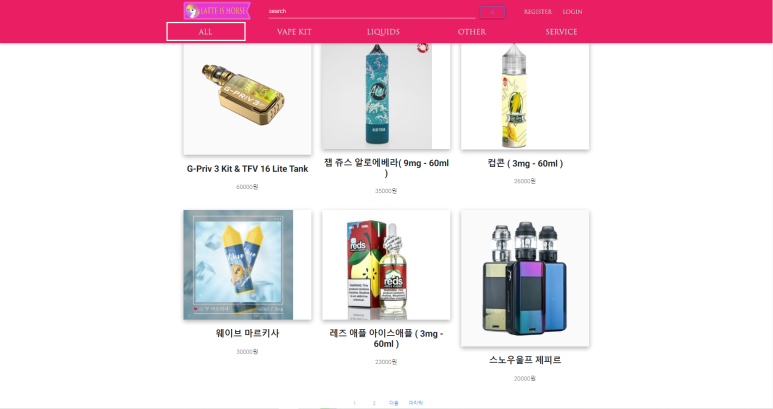

# HTML 학습 리포지토리
HTML5, CSS3, JS 학습용 리포지토리

------------------

## HTML5
HTML 기본학습

### HTML이란?
개요에 대해서 학습합니다.
1. Hyper Text Markup Language 정의
2. HTML 역사
3. HTML5의 

- Hyper Text Markup *Language* 정의
- __HTML__ _역사_
- **HTML5**의 ~차이점~
  - UL2
    - SUL3
    - SUL4

``` csharp
using System.IO;

namespace HelloWorldApp {
  public class Program {
    public static void Main(String[] args) {
      Console.WriteLine("Hello World!");
      // Hello World 10 WOW!
    }
  }
}
```
---------


## Latte Is Horse Project

------------------

- MainPage


- All Cartegory


- Cartegory-Vape Kit


- Cartegory-Liquids


------------------

+ [ ] 학습하기
+ [x] 학습하기

😊

참조링크
-------
- [Microsoft](https://www.microsoft.com)
- [Naver](https://www.naver.com)

--------------------------

## CSS3
CSS 기본 학습

> CSS is Cascading Style Sheets
------------------

## JavaScript
JavaScript 기본학습

------------------

## Responsive Web
응답형 웹 기본 학습

------------------

## Project
전체 통합 프로젝트

----------------

문의메일 : <ieyeppo@gmail.com>

-------------------


